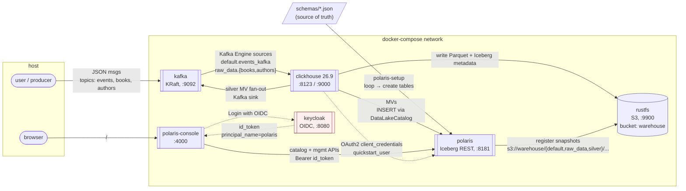

# kafka-clickhouse-lakehouse

Local docker-compose dev stack: Kafka (KRaft) → ClickHouse → Iceberg (via Apache
Polaris REST catalog) → RustFS (S3-compatible). Keycloak is wired in as an OIDC
provider for human/UI auth; ClickHouse talks to Polaris with internal
client-credentials.

## Architecture



**Two auth paths into Polaris** — intentional:
- **Machine (ClickHouse)**: Polaris's own OAuth2 client-credentials. Fast,
  stateless, no browser.
- **Human (Polaris Console)**: OIDC via Keycloak, PKCE flow. Token's
  `principal_name=polaris` claim maps to a Polaris principal with the same
  catalog grants.

## Services

| Service     | Image                            | Host port(s)   |
|-------------|----------------------------------|----------------|
| kafka       | `apache/kafka:4.3.1`             | `9092`         |
| rustfs      | `rustfs/rustfs:1.0.0-alpha.81`   | `9900`, `9001` |
| keycloak    | `quay.io/keycloak/keycloak:26.6.4` | `8080`       |
| polaris     | `apache/polaris:latest`          | `8181`, `8182` |
| clickhouse  | `clickhouse/clickhouse-server:26.9` | `8123`, `9000` |
| polaris-console | built from `apache/polaris-tools` (main) | `4000`     |

One-shot init containers:
- `bucket-setup` — creates the `warehouse` bucket in RustFS
- `kafka-topic-setup` — creates topics `events`, `books`, `authors`
- `polaris-setup` — bootstraps the catalog, principal, role, privileges, then
  **loops over `schemas/*.json`** to create each Iceberg namespace + table (via
  Polaris's Iceberg REST API — ClickHouse 26.9 can `INSERT` and `SELECT`
  through a `DataLakeCatalog` database but can't yet `CREATE TABLE` through
  it, so we pre-create tables catalog-side). Polaris is the single source of
  truth for Iceberg schemas.

## Quick start

```sh
docker compose up -d
docker compose ps        # wait for everything to be healthy
```

On first boot, ClickHouse automatically runs every file under
[clickhouse/docker-entrypoint-initdb.d/](clickhouse/docker-entrypoint-initdb.d/)
in filename order:

| File | What it creates |
|---|---|
| `01-polaris-catalog.sql` | `polaris_catalog` database (DataLakeCatalog → Polaris REST); Kafka Engine source `default.events_kafka` + MV landing it in `polaris_catalog.\`default.events\`` |
| `02-book-store-raw.sql` | Kafka Engine sources `raw_data.{books,authors}` + MVs landing them in `polaris_catalog.\`raw_data.{books,authors}\`` |
| `03-book-store-silver.sql` | Silver MV joining `raw_data.books` + `raw_data.authors` into `polaris_catalog.\`silver.books_authors\``, plus a Kafka sink MV that fan-outs the same JOIN result to the `book_authors` topic |

Iceberg target tables are pre-created by `polaris-setup` from the JSON files
in [schemas/](schemas/).

## Adding an Iceberg table

Three mechanical edits, no inline JSON:

1. **Add a Kafka topic** — a line in `kafka-topic-setup` in
   [docker-compose.yml](docker-compose.yml).
2. **Drop a schema file** — new `schemas/<name>.json` with Iceberg field
   types (`long`, `string`, `int`, `timestamp`, …). The `namespace` and `name`
   fields at the top become the Polaris namespace + table name.
3. **Add a Kafka Engine + MV block** to one of the files under
   [clickhouse/docker-entrypoint-initdb.d/](clickhouse/docker-entrypoint-initdb.d/)
   (or a new numbered file). Column names and types must match the Iceberg
   schema from step 2.

### Applying to a running stack

The CH init SQL only runs on first boot (empty data dir). To apply changes
to a running stack:

```sh
# 1. Re-run the Polaris schema loop (idempotent — unchanged schemas are no-ops)
docker compose rm -sf polaris-setup && docker compose up -d polaris-setup

# 2. Re-run the ClickHouse DDL by hand (every file, in order)
for f in clickhouse/docker-entrypoint-initdb.d/*.sql; do
  echo "--- $f ---"
  docker compose exec -T clickhouse clickhouse-client --multiquery < "$f"
done
```

Both are `IF NOT EXISTS` / idempotent, so re-running is safe.

## End-to-end verification

This exercises every pipeline in the stack: the simple `events` ingestion, the
medallion pipeline (`raw_data.*` → `silver.*`), and the Kafka fan-out that
re-publishes the silver JOIN result onto a new topic.

> `-T` on `docker compose exec` disables TTY allocation so the heredoc stdin
> works. `-it` fails with "the input device is not a TTY" because stdin is a
> pipe.

### 1. Produce test messages

```sh
# authors first — the silver JOIN needs the author row to exist when the
# book arrives (CH MVs trigger only on the leftmost source, raw_data.books)
docker compose exec -T kafka /opt/kafka/bin/kafka-console-producer.sh \
    --bootstrap-server kafka:19092 --topic authors <<EOF
{"id": 10, "name": "Frank Herbert"}
EOF

docker compose exec -T kafka /opt/kafka/bin/kafka-console-producer.sh \
    --bootstrap-server kafka:19092 --topic books <<EOF
{"id": 1, "author_id": 10, "title": "Dune",         "price": 15.99, "stock_quantity": 42}
{"id": 2, "author_id": 10, "title": "Dune Messiah", "price": 12.50, "stock_quantity": 17}
EOF

# events — unrelated to the book domain, just the simplest pipeline
docker compose exec -T kafka /opt/kafka/bin/kafka-console-producer.sh \
    --bootstrap-server kafka:19092 --topic events <<EOF
{"id": 1, "msg": "hello", "ts": "2026-10-02 12:00:00.000000"}
{"id": 2, "msg": "world", "ts": "2026-10-02 12:00:01.000000"}
EOF

sleep 15   # let the materialized views flush
```

### 2. Check Iceberg row counts

```sh
docker compose exec clickhouse clickhouse-client -q "
SELECT 'default.events'       AS t, count() c FROM polaris_catalog.\`default.events\`       UNION ALL
SELECT 'raw_data.books'       AS t, count() c FROM polaris_catalog.\`raw_data.books\`       UNION ALL
SELECT 'raw_data.authors'     AS t, count() c FROM polaris_catalog.\`raw_data.authors\`     UNION ALL
SELECT 'silver.books_authors' AS t, count() c FROM polaris_catalog.\`silver.books_authors\`
ORDER BY t FORMAT PrettyCompact
"
```

Expect `2, 2, 1, 2` respectively.

### 3. Inspect the silver JOIN output

```sh
docker compose exec clickhouse clickhouse-client -q "
SELECT * FROM polaris_catalog.\`silver.books_authors\` ORDER BY id FORMAT PrettyCompact
"
```

Expect two rows, each with `author_name = 'Frank Herbert'`.

### 4. Confirm the silver → Kafka fan-out

The silver MV has a sibling that writes the same JOIN result to the
`book_authors` Kafka topic:

```sh
docker compose exec -T kafka /opt/kafka/bin/kafka-console-consumer.sh \
    --bootstrap-server kafka:19092 --topic book_authors \
    --from-beginning --timeout-ms 5000
```

Expect two JSON lines like
`{"id":1,"author_name":"Frank Herbert","title":"Dune","price":15.99,"stock_quantity":42}`.
The `TimeoutException` at the end is just the consumer exiting after the idle
window — not an error.

### 5. Confirm Parquet files landed in RustFS

Open <http://localhost:9001> (login `polaris_root` / `polaris_pass`) and browse
the `warehouse` bucket. Expect `data/*.parquet` + `metadata/*.{json,avro}`
under each of `default/events/`, `raw_data/{books,authors}/`, and
`silver/books_authors/`.

Or via CLI:

```sh
docker compose exec -T polaris-setup sh -c '
  apk add -q --no-cache aws-cli;
  AWS_ACCESS_KEY_ID=polaris_root AWS_SECRET_ACCESS_KEY=polaris_pass \
  AWS_DEFAULT_REGION=us-west-2 \
    aws s3 ls s3://warehouse/ --recursive --endpoint-url http://rustfs:9900
'
```

## UIs & credentials

| Service              | URL                                | Login                          |
|----------------------|------------------------------------|--------------------------------|
| ClickHouse HTTP      | <http://localhost:8123/play>       | `default` / _(empty)_          |
| Keycloak Admin       | <http://localhost:8080>            | `admin` / `admin`              |
| RustFS Console       | <http://localhost:9001>            | `polaris_root` / `polaris_pass`|
| Polaris Console      | <http://localhost:4000>            | Click **Login with OIDC** → `polaris` / `polaris` (see below) |
| Polaris Health       | <http://localhost:8182/q/health>   | —                              |

### Logging into the Polaris Console

1. Open <http://localhost:4000>.
2. Click **Login with OIDC**. You're redirected to Keycloak.
3. Sign in with `polaris` / `polaris`.
4. Keycloak redirects you back to the console, authenticated.

The `polaris` Keycloak user is defined in [keycloak/iceberg-realm.json](keycloak/iceberg-realm.json)
and auto-imported on first boot. Its OIDC token carries `principal_name=polaris`,
which maps to a Polaris principal of the same name — `polaris-setup` grants
that principal `quickstart_user_role`, which has read/write on
`quickstart_catalog`.

## All credentials (cheat sheet)

| Context                                             | Who                   | Credentials                       |
|-----------------------------------------------------|-----------------------|-----------------------------------|
| Polaris Console (UI login via Keycloak)             | human                 | `polaris` / `polaris`             |
| Keycloak Admin Console                              | admin                 | `admin` / `admin`                 |
| Polaris machine-to-machine (ClickHouse, curl, etc.) | `quickstart_user`     | `quickstart_user` / `quickstart_pass` |
| Polaris bootstrap/root (admin API)                  | root client           | `root` / `s3cr3t`                 |
| RustFS Console (S3 UI)                              | S3 user               | `polaris_root` / `polaris_pass`   |
| ClickHouse HTTP + native                            | `default`             | _(no password)_                   |

## Machine credentials (ClickHouse → Polaris)

| Field          | Value                                                      |
|----------------|------------------------------------------------------------|
| Client ID      | `quickstart_user`                                          |
| Client Secret  | `quickstart_pass`                                          |
| Scope          | `PRINCIPAL_ROLE:ALL`                                       |
| Token endpoint | `http://polaris:8181/api/catalog/v1/oauth/tokens`          |
| Realm          | `POLARIS`                                                  |
| Catalog        | `quickstart_catalog`                                       |

Override by copying `.env.example` to `.env` and editing.

## Connect from DuckDB

```
INSTALL iceberg;
LOAD iceberg;

CREATE OR REPLACE SECRET polaris_secret (
    TYPE iceberg,
    CLIENT_ID 'quickstart_user',
    CLIENT_SECRET 'quickstart_pass',
    OAUTH2_SERVER_URI 'http://localhost:8181/api/catalog/v1/oauth/tokens',
    OAUTH2_SCOPE 'PRINCIPAL_ROLE:ALL'
);

ATTACH 'quickstart_catalog' AS polaris (
    TYPE iceberg,
    ENDPOINT 'http://localhost:8181/api/catalog',
    SECRET polaris_secret
);
SHOW ALL TABLES;
```

## Operational notes

- Polaris uses in-memory persistence — restart `polaris` and the catalog is
  gone. To recreate it, run `docker compose rm -sf polaris-setup && docker
  compose up -d polaris-setup`.
- Kafka's two listeners: in-compose consumers use `kafka:19092`, host-based
  tools use `localhost:9092`.
- When using `kafka-console-producer.sh` with a heredoc, pass `-T` (disable
  TTY) to `docker compose exec` — `-it` fails with "the input device is not
  a TTY" because stdin is a pipe.
- **Polaris Console build on macOS / Podman**: `docker compose up --build
  polaris-console` can fail with `error getting credentials ... User canceled
  the operation` even for public images — this is podman invoking
  `docker-credential-osxkeychain` and getting a dismissed Keychain prompt
  (not an AWS/ECR issue). Workaround: build with podman directly, then start
  the service without `--build`:
  ```sh
  podman build -t polaris-console:local \
      https://github.com/apache/polaris-tools.git#main:console \
      -f docker/Dockerfile
  docker compose up -d polaris-console
  ```
- Dev stack only. Credentials are checked-in defaults; do not reuse elsewhere.
